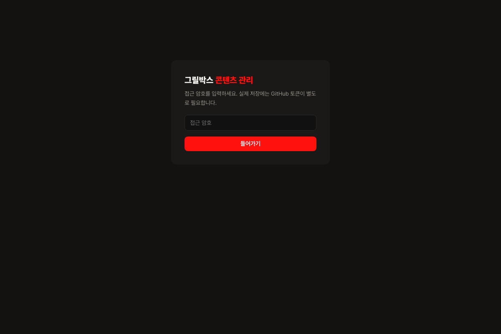
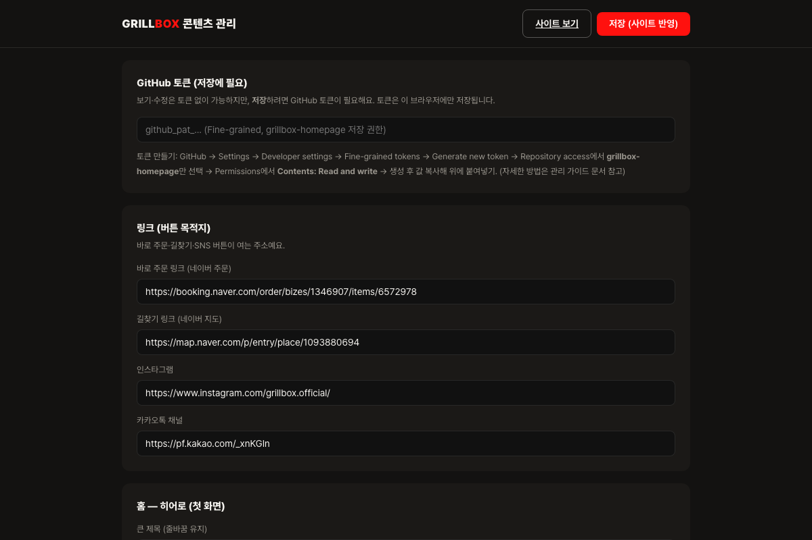
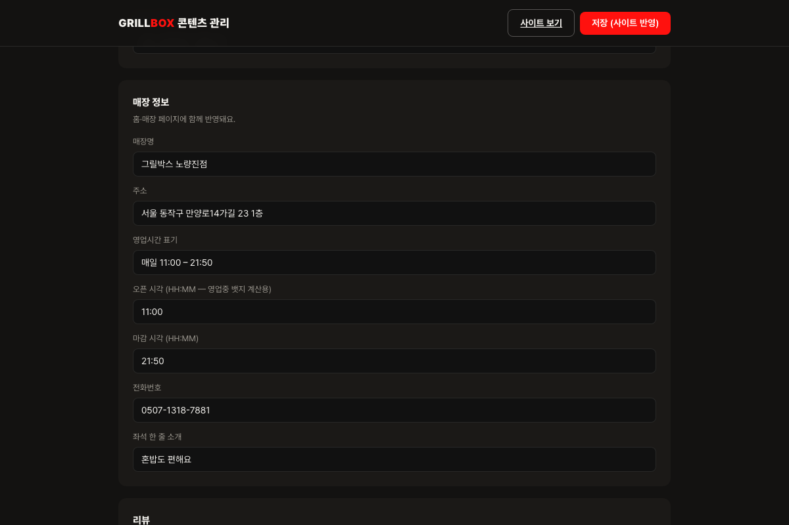
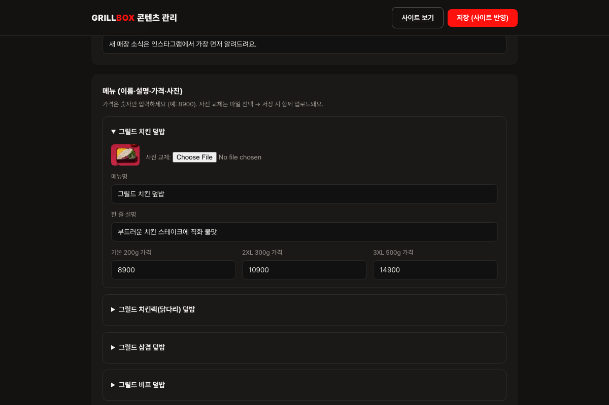
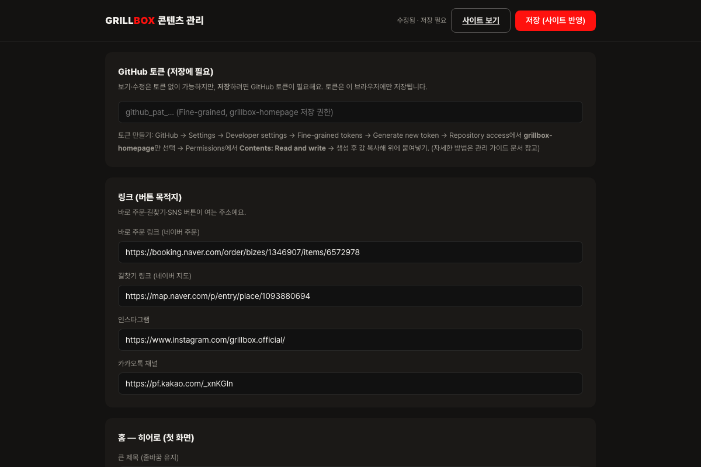

# 그릴박스 홈페이지 — 관리자 사용 가이드 (운영자용)

개발자 없이 홈페이지의 **문구·가격·이미지·매장정보**를 직접 수정할 수 있습니다.

- 관리자 주소: **`<사이트주소>/admin/`** (예: https://yjiihwan.github.io/grillbox-homepage/admin/)
- 접근 암호: **`grillbox2026!`**
- 수정 내용은 저장 후 **1~2분 뒤** 사이트에 반영됩니다.

---

## 1. 들어가기

관리자 주소에 접속하면 암호 화면이 나옵니다. 암호를 넣고 「들어가기」.

> ⚠️ 이 암호는 "화면 열람 문턱"일 뿐입니다. 실제로 사이트를 **수정(저장)** 하려면 아래 GitHub 토큰이 반드시 필요하므로, 암호가 새어나가도 사이트를 바꿀 수는 없습니다.

## 2. GitHub 토큰 등록 (최초 1회)

저장 버튼이 작동하려면 GitHub 토큰이 필요합니다. 토큰은 **이 브라우저에만** 저장되고 서버로 전송되지 않습니다(GitHub API 호출에만 사용).

1. https://github.com/settings/personal-access-tokens 접속 (yjiihwan 계정 로그인)
2. **Generate new token** 클릭
3. Token name: `grillbox-admin` (아무거나) / Expiration: 90일 권장
4. **Repository access → Only select repositories → `grillbox-homepage`** 선택
5. **Permissions → Repository permissions → Contents → Read and write** 선택
6. Generate token → 나온 `github_pat_…` 값을 복사
7. 관리자 화면 맨 위 「GitHub 토큰」 칸에 붙여넣기 (자동 저장됨)

## 3. 수정하기

섹션별로 입력칸이 나뉘어 있습니다. 칸의 내용을 고치면 화면 오른쪽 위에 「수정됨 · 저장 필요」가 표시됩니다.

| 섹션 | 수정 가능한 것 |
|---|---|
| 링크 | 바로 주문 · 길찾기 · 인스타그램 · 카카오채널 버튼의 목적지 주소 |
| 홈 문구 | 히어로 제목/부제, 고기양·직화 섹션 문구 |
| 매장 정보 | 매장명 · 주소 · 영업시간 · 전화번호 (홈+매장 페이지 동시 반영) |
| 리뷰 | 리뷰 3건 원문·방문시기·출처 표기 |
| 메뉴 | 16개 메뉴의 이름 · 한 줄 설명 · 사이즈별 가격 · **사진 교체** |

- **가격은 숫자만** 입력하세요 (예: `8900` — 원 표시는 자동).
- **영업시간**: "영업시간 표기"는 화면에 보이는 글, "오픈/마감 시각"(HH:MM)은 「지금 영업 중」 뱃지 자동 계산에 쓰입니다. 영업시간이 바뀌면 둘 다 고쳐주세요.
- **리뷰는 실제 고객 리뷰 원문만** 넣어주세요. 창작 리뷰는 표시광고법 리스크가 있습니다.

### 메뉴 사진 교체

메뉴 이름을 눌러 펼친 뒤 「사진 교체 → 파일 선택」. 2.5MB 이하 이미지만 가능합니다. 파일을 고르면 담긴 상태가 되고, **「저장」을 눌러야** 실제 업로드·반영됩니다.

## 4. 저장

오른쪽 위 **「저장 (사이트 반영)」** 을 누르면 GitHub에 커밋되고, 1~2분 뒤 사이트에 반영됩니다. 반영 확인은 사이트에서 **새로고침**(모바일은 당겨서 새로고침) 하세요.

- 저장 실패 시: 토큰이 만료됐거나 권한이 부족한 경우가 대부분입니다. §2를 다시 진행하세요.
- 잘못 저장했더라도 **모든 변경은 GitHub에 기록이 남아** 개발자(또는 개발봇)가 되돌릴 수 있습니다.

## 5. 자주 묻는 것

- **암호를 바꾸고 싶어요** → 개발봇에게 요청 (admin.js의 해시 교체 필요).
- **메뉴를 추가/삭제하고 싶어요** → 현재 화면에선 기존 16종 수정만 가능. 추가·삭제는 개발봇에게 요청.
- **홈의 대표 메뉴 3종을 바꾸고 싶어요** → 개발봇에게 요청 (content.json의 menuHighlight).
- **여기서 안 보이는 문구가 있어요** → 브랜드 스토리 등 일부 고정 문구는 의도적으로 잠겨 있습니다. 개발봇에게 요청.
