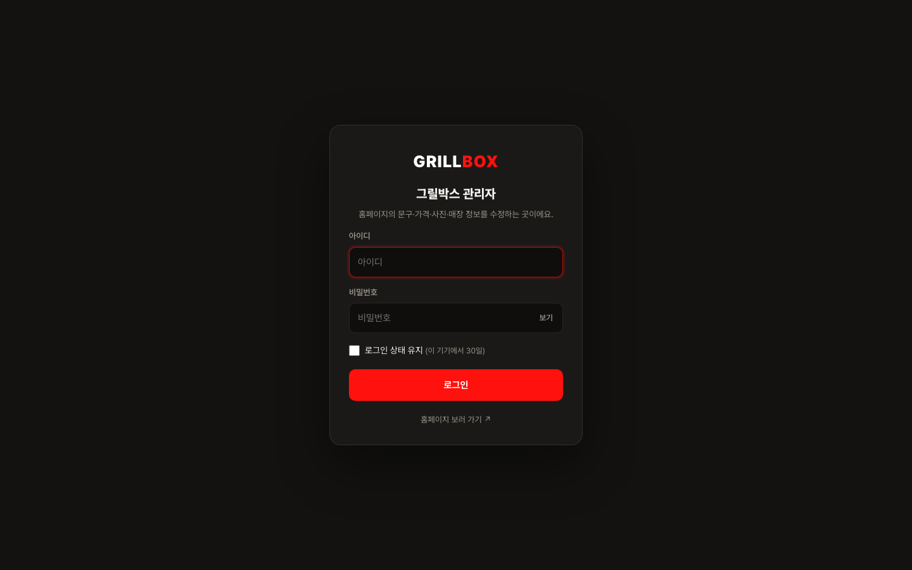
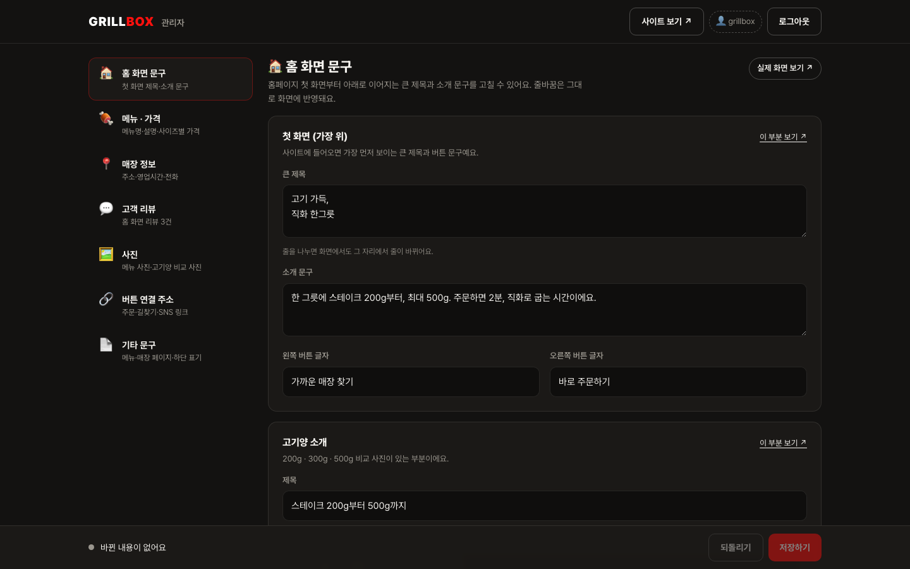
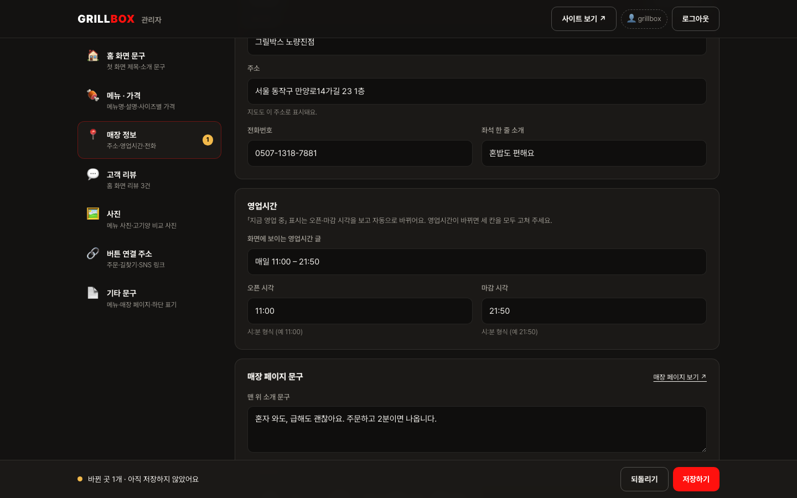
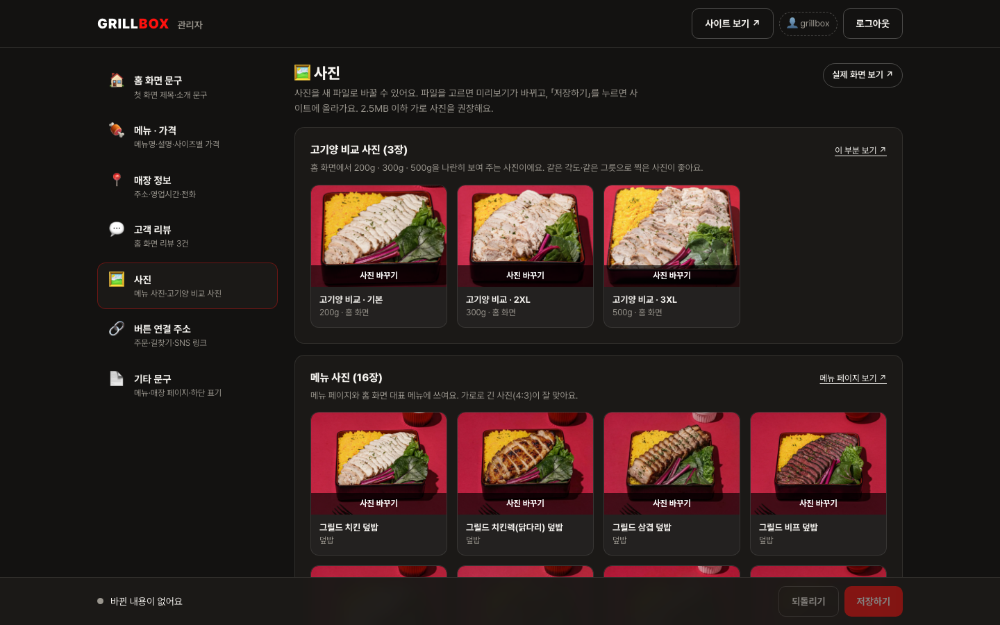
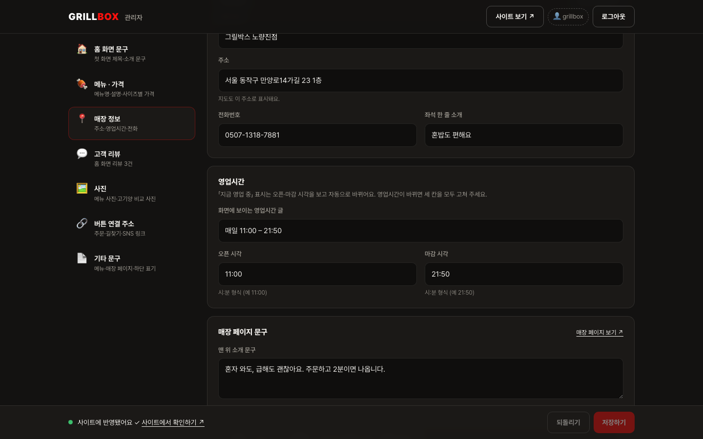

# 그릴박스 홈페이지 — 관리자 사용 가이드 (운영자용)

개발자 없이 홈페이지의 **문구 · 가격 · 사진 · 매장 정보 · 버튼 주소**를 직접 고칠 수 있습니다.

- 관리자 주소: **`<사이트주소>/admin/`** (예: https://yjiihwan.github.io/grillbox-homepage/admin/)
- 로그인: **아이디 + 비밀번호** (전달받은 값 사용 · 분실 시 개발 담당자에게 재발급 요청)
- 저장하면 **1~2분 뒤** 사이트에 반영됩니다.

---

## 1. 로그인

관리자 주소에 들어가면 로그인 화면이 나옵니다. 아이디와 비밀번호를 넣고 「로그인」을 누르세요.

- 아이디나 비밀번호가 틀리면 「아이디 또는 비밀번호가 올바르지 않습니다」가 뜹니다.
- **「로그인 상태 유지」** 를 켜면 이 기기에서 30일 동안 다시 로그인하지 않아도 됩니다. 공용 PC에서는 켜지 마세요.
- 오른쪽 위 **「로그아웃」** 을 누르면 즉시 로그아웃됩니다.

## 2. 화면 구성

왼쪽(모바일은 위쪽)에 수정할 항목 메뉴가 있고, 항목을 누르면 오른쪽에 입력칸이 나옵니다.

| 메뉴 | 고칠 수 있는 것 | 반영되는 곳 |
|---|---|---|
| 🏠 홈 화면 문구 | 첫 화면 큰 제목·소개, 고기양·직화 소개, 대표 메뉴 3종 선택, 인스타그램·마지막 안내 문구 | 홈 |
| 🍖 메뉴 · 가격 | 16개 메뉴의 이름 · 한 줄 설명 · 사이즈별 가격 · 사진 | 메뉴 페이지 + 홈 대표 메뉴 |
| 📍 매장 정보 | 매장 이름 · 주소 · 전화 · 영업시간 · 매장 페이지 문구 | 홈 + 매장 페이지 |
| 💬 고객 리뷰 | 리뷰 3건 내용 · 방문 시기 · 출처 표기 | 홈 |
| 🖼️ 사진 | 고기양 비교 사진 3장 · 메뉴 사진 16장 | 홈 + 메뉴 페이지 |
| 🔗 버튼 연결 주소 | 「바로 주문」「길찾기」「인스타그램」「카카오톡」 버튼이 여는 주소 | 모든 페이지 |
| 📄 기타 문구 | 메뉴 페이지 안내 · 원산지 안내 · 사이트 맨 아래 사업자 표기 | 메뉴 페이지 + 하단 |

- 각 항목 오른쪽 위 **「실제 화면 보기 ↗」**, 카드마다 있는 **「이 부분 보기 ↗」** 를 누르면 그 문구가 실제로 어디에 보이는지 새 창으로 확인할 수 있습니다.
- 입력칸 아래 회색 글씨는 그 칸에 대한 설명입니다.

## 3. 수정하기

칸의 내용을 고치면 테두리가 노랗게 바뀌고, 아래 저장 바에 **「바뀐 곳 N개 · 아직 저장하지 않았어요」** 가 표시됩니다. 메뉴 옆에도 바뀐 개수가 배지로 붙습니다.

- **가격은 숫자만** 입력하세요 (예: `8900`). 쉼표와 「원」은 자동으로 붙습니다.
- **영업시간**: 「화면에 보이는 영업시간 글」은 그대로 보이는 문구, 「오픈/마감 시각」은 「지금 영업 중」 표시 계산에 쓰입니다. 영업시간이 바뀌면 **세 칸 모두** 고쳐 주세요.
- **리뷰는 실제 고객 리뷰 원문만** 넣어 주세요. 만든 리뷰는 표시광고법 위반 소지가 있습니다.
- **줄바꿈**은 그대로 화면에 반영됩니다 (큰 제목, 직화 소개 본문 등).
- 잘못 고쳤으면 저장 전에 **「되돌리기」** 를 누르면 마지막 저장 상태로 돌아갑니다.

### 사진 바꾸기

「사진」 메뉴(또는 메뉴 카드의 사진)에서 **「사진 바꾸기」 → 파일 선택**. 고르면 바로 미리보기가 바뀌고 「저장하면 교체돼요」 표시가 붙습니다. **「저장하기」를 눌러야** 실제로 사이트에 올라갑니다. 마음이 바뀌면 「바꾸기 취소」.

- jpg · png · webp, **2.5MB 이하**. 가로로 긴 사진(4:3)이 잘 맞습니다.
- 고기양 비교 사진 3장은 같은 각도·같은 그릇으로 찍은 사진이 좋습니다.

## 4. 저장하기

아래 저장 바의 **「저장하기」** (또는 Ctrl/⌘+S)를 누르면:

1. 「저장 중…」 (사진이 있으면 「사진 올리는 중… (1/3)」처럼 진행 표시)
2. **「저장 완료 ✓ 사이트에 반영되는 중이에요 (보통 1~2분)…」**
3. 반영이 끝나면 자동으로 **「사이트에 반영됐어요 ✓ 사이트에서 확인하기 ↗」** 로 바뀝니다.

사이트에서 확인할 때는 **새로고침**(모바일은 아래로 당겨서 새로고침)하세요.

### 저장이 안 될 때

화면에 원인과 해결 방법이 한글로 표시됩니다. 대부분 아래 셋 중 하나입니다.

| 표시 | 해결 |
|---|---|
| 인터넷 연결을 확인해 주세요 | 잠시 후 다시 「저장하기」 |
| 다른 곳에서 먼저 저장된 내용이 있어요 | 새로고침(F5) 후 다시 수정 |
| 저장 권한을 확인할 수 없어요 | 로그아웃 → 다시 로그인. 계속되면 개발 담당자에게 「관리자 계정 설정 갱신」 요청 |

잘못 저장했더라도 **모든 변경 기록이 남아** 개발 담당자가 되돌릴 수 있습니다.

## 5. 자주 묻는 것

- **비밀번호를 잊었어요 / 바꾸고 싶어요** → 개발 담당자에게 요청 (새 아이디·비밀번호 발급, 몇 분 걸림).
- **메뉴를 추가·삭제하고 싶어요** → 현재는 기존 16종 수정만 가능. 추가·삭제는 개발 담당자에게 요청.
- **여기서 안 보이는 문구가 있어요** → 브랜드 스토리 등 일부 고정 문구는 의도적으로 잠겨 있습니다. 개발 담당자에게 요청.
- **여러 사람이 같이 써도 되나요** → 가능하지만 같은 시간에 동시에 저장하면 「다른 곳에서 먼저 저장된 내용이 있어요」가 뜰 수 있습니다. 새로고침 후 다시 수정하세요.
